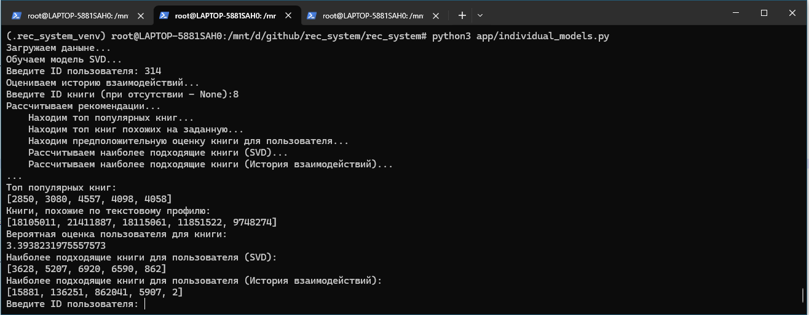
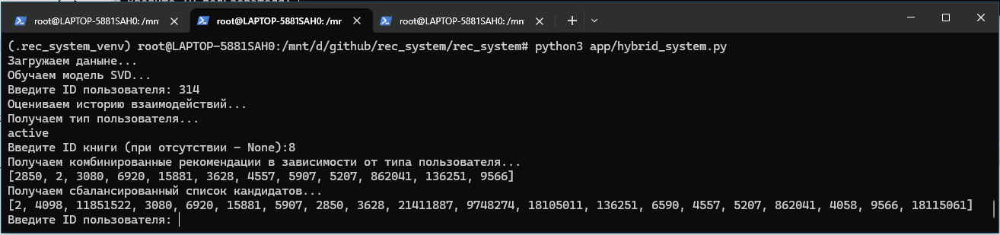
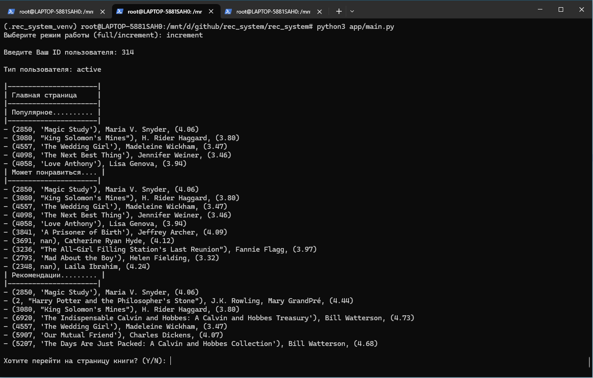

---

# Разработка гибридной системы рекомендаций книг с нейросетевыми моделями

Учебный проект по созданию гибридной рекомендательной системы для персонализированного подбора книг

---

## Цель разработки

Разработать комплексную гибридную систему рекомендаций книг, объединяющую 
классические подходы из домашнего задания с современными нейросетевыми 
архитектурами для улучшения качества рекомендаций.  

Система сочетает пять уровней моделирования:
* Модель популярности (топ-N популярных книг),
* Контентная модель (похожие книги по тегам и названиям),
* Коллаборативная фильтрация (Item-Based),
* Матричная факторизация (SVD),
* Дополнительная модель, основанная на истории взаимодействия пользователя.

---

## Основной функционал

Система позволяет:

1. **Определять тип пользователя**  
	Классификация пользователей на активных и новых на основе среднего рейтинга, активности и количества оцененных книг.
2. **Предоставлять персональные рекомендации**  
	Гибридная система рекомендует пользователю книги, основываясь на комбинации четырех моделей.
3. **Формировать сбалансированный список рекомендаций**  
	Балансировка финального списка книг с целью достижения оптимального сочетания качества рекомендаций и разнообразия предложений.
4. **Прогнозировать оценки пользователя**  
	Определение вероятной оценки пользователя для новой книги, учитывая предыдущие оценки.

---

## Особенности

* **Комплексный подход** — комбинация различных классов моделей обеспечивает лучшее покрытие предпочтений пользователей.
* **Возможность автоматического переобучения или использование имеющихся метаданных** — два режима работы (full/increment) позволяют 
при необходимости переобучаются на свежих данных, поддерживая высокую эффективность рекомендаций, или же работать 
на имеющихся метаданных, обеспечивая высокое быстродействие.
* **Балансировка рекомендаций** — система фильтрует дублирующиеся и однотипные рекомендации, повышая разнообразие предлагаемого материала.
* **Удобство эксплуатации** — простота настройки и развертывания.

---

## Инструкция по развертыванию

### Требования

- Версия Python: **3.11.14**

---

### Установка

1. **Клонирование репозитория:**
   ```bash
   git clone https://github.com/Boryan71/rec_system.git
   cd rec_system
   ```

2. **Установка виртуального окружения** (необязательно):
   ```bash
   python -m venv venv
   source venv/bin/activate		# Linux/macOS
   
   venv\Scripts\activate        # Windows
   ```

3. **Установка зависимостей:**
   ```bash
   pip install --upgrade pip
   pip install -r requirements.txt
   ```

4. **Запуск приложения:**
   ```bash
   python app/individual_models.py	# Отдельные рекомендательные модели
   python app/hybrid_system.py		# Гибридная рекомендательная система
   python app/main.py				# "Книжный маркетплейс" для командной строки (в процессе разарботки)
   ```

---

## Использование приложения

На данный момент реализовано несколько модулей, позволяющих получить рекомендацию:
* [Отдельные рекомендательные модели](./app/individual_models.py) - при вводе идентификатора пользователя и книги, позволяет получить:
	- Топ популярных книг
	- Книги, похожие по текстовому профилю на заданную,
	- Вероятную оценку пользователя для заданной книги,
	- Наиболее подходящие книги для пользователя (на основе модели SVD),
	- Наиболее подходящие книги для пользователя (на основе модели, оценивающей историю взаимодействий пользователя).
	
	

* [Гибридная рекомендательная система](./app/hybrid_system.py) - при вводе идентификатора пользователя и книги, позволяет получить:
	- Комбинированные рекомендации в зависимости от типа пользователя (новый/активный),
	- Сбалансированный по разнообразию и релевантности список рекомендаций.
	
	
	
* Начата работа над ["приложением"](./app/main.py) в командной строке, имитирующем книжный "маркетплейс".

	
	
На последнем скриншоте видно, что система может инициализироваться в двух режимах:
* full - при новом наборе данных, либо при первоначальной установке:
	- Рассчитывает [оптимальные гиперпараметры](./app/support_files/best_params_svd.txt) для модели SVD и сохраняет их для дальнейшего использования.
	- Рассчитывает [матрицу схожести](./app/support_files/users_interaction_matrix/122_interaction_matrix.csv) с историей взаимодействий пользователя.
	
* increment - для текущей работы:
	- Система использует сохраненные [метаданные](./app/support_files) для работы моделей.
	- При отсутствии метаданных, рассчитывает их и сохраняет для дальнейшего использования.

---

## Структура проекта

```
.
├── README.md									
├── app										# Рабочая папка приложения
│   ├── hybrid_system.py						# Модели гибридной системы рекомендаций
│   ├── individual_models.py					# Отдельные модели системы рекомендаций
│   ├── util_load_best_params_svd.py			# Вспомогательный модуль для расчета гиперпараметров модели SVD
│   ├── util_load_interaction_matrix.py			# Вспомогательный модуль для расчета матрицы признаков взаимодействия пользователя
│   ├── util_make_datasets.py					# Вспомогательный модуль для загрузки сырых данных и создания расширенных признаков
│   ├── support_files							# Каталог с рабочими файлами
│   │   ├── best_params_svd.txt						# Рассчитанные гиперпараметры модели SVD
│   │   └── users_interaction_matrix				# Каталог с матрицами взаимодействия пользователей
│   │       ├── 122_interaction_matrix.csv				# Матрица взаимодействия пользователя 122
│   │       ├── 132_interaction_matrix.csv
│   │       ├── 314_interaction_matrix.csv
│   │       └── 428_interaction_matrix.csv
├── data									# Каталог с сырыми данными
│   ├── book_tags.csv
│   ├── books.csv
│   ├── ratings.csv
│   ├── tags.csv
│   └── to_read.csv
├── notebooks								# Каталог с jupyter-ноутбуками модулей
│   ├── evaluate.ipynb						# Jupyter-ноутбук со сравнительным анализом метрик
│   ├── hybrid_system.ipynb
│   ├── individual_models.ipynb
│   ├── util_load_best_params_svd.ipynb
│   ├── util_load_interaction_matrix.ipynb
│   └── util_make_datasets.ipynb
└── requirements.txt						# Список зависимостей		
```

---

## Планы по доработке

* Создание скрипта для оценки метрик в фоновом режиме
* Доработка UI и функциональности main.py
* Внедрение нейросетевой модели
* Переход на использование классов в структуре